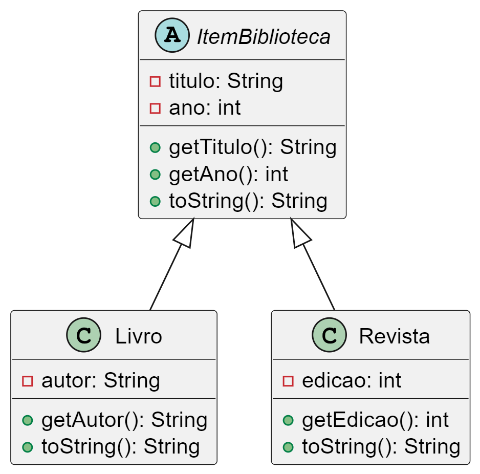

# **Nível Estagiário – Fundamentos e Boas Práticas**

## **1. Cadastro Simples de Produtos**

**Objetivo:** Criar uma classe `Produto` com atributos `nome`, `preco` e `quantidade`.
**Desafio:** Criar um menu de texto para cadastrar produtos e mostrar todos os produtos cadastrados.
**Requisitos:**

* Encapsulamento.
* Validação de dados (ex: preço e quantidade não podem ser negativos).
* `toString()` personalizado.

---

## **2. Controle de Conta Bancária**

**Objetivo:** Criar uma classe `ContaBancaria` com métodos para `sacar`, `depositar` e `consultarSaldo`.
**Desafio:** Criar uma interface `OperacoesConta` e implementá-la na classe.
**Requisitos:**

* Uso de interface.
* Tratamento de exceções para saques indevidos.
* Separação entre modelo (classe) e lógica de uso (main).

---

## **3. Gerenciamento de Tarefas**

**Objetivo:** Criar classes `Tarefa` e `GerenciadorDeTarefas`.
**Desafio:** Adicionar, remover, listar tarefas e marcar como concluída.
**Requisitos:**

* Uso de `ArrayList`.
* Uso de `enum` para status (`PENDENTE`, `CONCLUIDA`).
* Responsabilidade única (SRP).

---

## **4. Sistema de Notas**

**Objetivo:** Criar classe `Aluno` com nome e notas, e calcular média.
**Desafio:** Informar se o aluno está aprovado (média ≥ 6).
**Requisitos:**

* Uso de métodos privados para lógica de média.
* Separação de responsabilidades entre entrada e cálculo.

---

## **5. Agenda Telefônica**

**Objetivo:** Criar uma agenda que armazena contatos (nome + telefone).
**Desafio:** Buscar por nome e exibir todos os contatos.
**Requisitos:**

* Uso de `HashMap<String, String>`.
* Boas práticas de escrita de métodos (`get`, `add`, `list`).

---

## **Nível Júnior – Orientação a Objetos + Padrões**

### **6. Biblioteca com Herança**

**Objetivo:** Criar uma superclasse `ItemBiblioteca` e subclasses `Livro` e `Revista`.
**Desafio:** Implementar um sistema para listar todos os itens disponíveis e emprestar.
**Requisitos:**

* Herança e polimorfismo.
* Princípios de Liskov e Open/Closed.
* Uso de `instanceof` só se justificável.

---

### **7. Sistema de Pedidos com Composição**

**Objetivo:** Classe `Pedido` que contém vários `ItemPedido`.
**Desafio:** Calcular valor total e permitir a adição/remoção de itens.
**Requisitos:**

* Composição.
* Boas práticas de modelagem.
* `BigDecimal` no lugar de `double`.

---

### **8. Controle de Funcionários com Interface**

**Objetivo:** Interface `Funcionario` com método `calcularSalario()`.
**Desafio:** Implementar classes `FuncionarioCLT` e `FuncionarioPJ`.
**Requisitos:**

* Uso de polimorfismo.
* `List<Funcionario>` com cálculo do custo mensal total.
* OCP e SRP.

---

### **9. Cadastro com Validação e DAO Simulado**

**Objetivo:** Criar CRUD de usuários com validação e persistência em memória.
**Desafio:** Separar em camadas: Model, Controller e DAO.
**Requisitos:**

* Padrão DAO (sem banco real).
* Validações com exceptions personalizadas.
* Arquitetura MVC (simples).

---

### **10. Aplicando o Padrão Strategy**

**Objetivo:** Sistema de cálculo de frete com diferentes estratégias (Normal, Expresso).
**Desafio:** Usar padrão Strategy para escolher algoritmo de frete em tempo de execução.
**Requisitos:**

* Interfaces para estratégias.
* Evitar `if`/`else` extensivos.
* Boa separação entre contexto e estratégias.

## 🧩 **Desafio: Sistema de Controle de Biblioteca (UML)**

### 🎯 **Objetivo**

Implementar, em Java, o sistema de controle de uma biblioteca com base na UML fornecida abaixo.

---

### 📘 **UML (Diagrama de Classes)**

### 🧪 **O que deve ser feito**

1. Criar a superclasse `ItemBiblioteca`.
2. Criar as subclasses `Livro` e `Revista` conforme o diagrama.
3. Criar uma classe `BibliotecaApp` com `main`, que:

   * Cadastre ao menos 2 livros e 2 revistas.
   * Adicione todos os itens em uma `List<ItemBiblioteca>`.
   * Imprima todos os itens usando polimorfismo.

---

### 🔍 **Requisitos Técnicos**

* Usar **encapsulamento** correto (`private` + `getters`).
* A classe `ItemBiblioteca` deve ser **abstrata**, pois não instanciamos diretamente um item genérico.
* O método `toString()` deve ser sobrescrito corretamente nas subclasses.
* Aplicar **boas práticas de nomeação e organização**.

---

### ✅ **Critérios de Avaliação**

| Critério                              | Peso |
| ------------------------------------- | ---- |
| Implementação correta da UML          | 30%  |
| Uso correto de herança e polimorfismo | 25%  |
| Clareza e organização do código       | 20%  |
| Encapsulamento e boas práticas        | 15%  |
| Funcionalidade da classe principal    | 10%  |

---

### 💡 **Dica**

Esse tipo de exercício é comum em entrevistas técnicas. Concentre-se em **traduzir corretamente a UML** para o código, entendendo as relações entre as classes, e sempre escreva código **limpo e comentado**.
