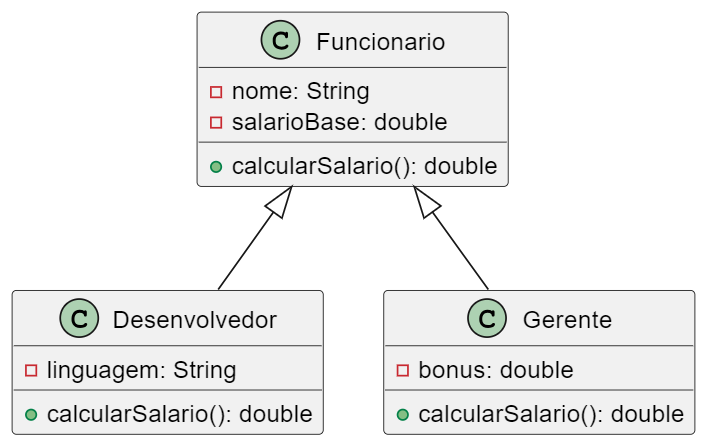

# Trabalho Avaliativo – Programação OO em Java (3,0 pontos)

**Instruções gerais:**

* Este trabalho vale 3,0 pontos no total.
* Responda **todas** as questões de forma clara, escrevendo código Java e/ou diagramas UML à mão (não é necessário executar em IDE).
* Sempre que for solicitado código, escreva a sintaxe Java completa (assinatura das classes, imports, métodos, etc.).
* Utilize, quando solicitado, diagramas de classes em notação UML básica (classes, atributos com visibilidade, métodos com parâmetros).
* Organize seu caderno, identifique cada questão com seu número e pontuação.

---

## Questão 1 – Introdução à Programação Orientada a Objetos em Java (0,5 ponto)

1.1) **Conceitos (0,2 ponto)**
a) Defina, em até duas linhas cada, os termos classe, objeto, atributo e método.
b) Explique brevemente o conceito de encapsulamento e como ele é aplicado em Java.

1.2) **Exercício prático (0,3 pt)**
Considere o seguinte cenário: você deve modelar, em Java, uma entidade “Aluno” que possua —

* número de matrícula (inteiro),
* nome completo (String),
* curso (String),
* nota final (double).

a) Escreva o código completo da classe `Aluno`, com:

* todos os atributos privados (`private`),
* um construtor que receba todos os campos em parâmetros,
* métodos getters e setters para cada atributo,
* um método público `imprimirDados()` que exiba no console (System.out.println) todas as informações do aluno.

b) Na mesma questão, mostre na forma de código (pode ser dentro de um `main` ou comentário) como criar um objeto `Aluno` com matrícula 2023001, nome “Ana Silva”, curso “Engenharia da Computação” e nota final 8.5, e em seguida chamar `imprimirDados()`.

---

### Questão 2 – Aprofundamento de Herança e Polimorfismo em Java (0,5 ponto)

Considere a hierarquia de classes abaixo (basta escrever no caderno; não é necessário criar arquivos .java reais):



2.1) **Herança e sobrescrita (override) (0,3 pt)**
a) Escreva o código completo da classe abstrata `Funcionario`, contendo:

* atributos `protected String nome;` e `protected double salarioBase;`
* construtor que receba `nome` e `salarioBase`;
* método `public abstract double calcularSalario();`

b) Implemente a classe `Desenvolvedor` que herda de `Funcionario` e adiciona o atributo `private String linguagem;`.

* Crie um construtor que receba `nome`, `salarioBase` e `linguagem`.
* Sobreponha (`@Override`) o método `calcularSalario()` de modo que retorne o valor de `salarioBase` acrescido de 10% caso `linguagem` seja “Java”; caso contrário, retorne apenas `salarioBase`.

c) Implemente a classe `Gerente` que herda de `Funcionario` e adiciona o atributo `private double bonus;`.

* Construtor que receba `nome`, `salarioBase` e `bonus`.
* Sobreponha (`@Override`) `calcularSalario()` para retornar `salarioBase + bonus`.

2.2) **Polimorfismo dinâmico (0,2 pt)**
a) No método `main(String[] args)`, escreva código que:

* Crie um array `Funcionario[] equipe = new Funcionario[2];`
* Adicione em `equipe[0]` um `Desenvolvedor("Pedro", 4000.0, "Java")`.
* Adicione em `equipe[1]` um `Gerente("Mariana", 6000.0, 1500.0)`.

b) Utilize um laço (`for` ou `enhanced for`) para percorrer `equipe` e imprimir, para cada funcionário, o resultado de `calcularSalario()`. Explique em uma frase por que esse código ilustra polimorfismo em Java.

---

### Questão 3 – Implementação de Tratamento de Exceções em Java (0,5 ponto)

3.1) **Exceções prontas (0,2 pt)**
Explique brevemente (até 3 linhas) quando se utiliza cada uma das seguintes exceções nativas de Java:

* `NullPointerException`
* `IllegalArgumentException`
* `SQLException`

3.2) **Exercício prático (0,3 pt)**
Escreva um método estático em Java chamado `public static int dividir(int a, int b)` que:

* Retorne `a / b` quando `b != 0`.
* Lance uma `IllegalArgumentException` (com mensagem “Divisor não pode ser zero”) se o parâmetro `b` for zero.

Em seguida, escreva outro método `public static void testarDivisao(int a, int b)` que chame `dividir(a, b)` dentro de um bloco `try/catch`, capturando `IllegalArgumentException`.

* Dentro de `catch`, imprima no console (`System.out.println`) a mensagem da exceção.
* No bloco `try`, caso não ocorra exceção, imprima “Resultado: ” seguido do valor retornado.

Por fim, indique como você chamaria `testarDivisao(10, 2)` e `testarDivisao(5, 0)` no `main`, e mostre a saída esperada no console para cada chamada.

---

### Questão 4 – Programação Paralela em Java: Threads (0,5 ponto)

4.1) **Conceitos (0,2 pt)**
a) Explique (em até duas linhas) a diferença entre:

* Estender `Thread` (classe) versus implementar `Runnable` (interface).
* Método `start()` e `run()` em uma classe que herda `Thread`.

b) Em que situações simples de um estágio/júnior você utilizaria threads em uma aplicação Java? Cite ao menos dois exemplos curtos (1 linha cada).

4.2) **Exercício prático (0,3 pt)**
Projete uma classe Java chamada `ContadorThread` que implemente `Runnable`, com as seguintes características:

* Possua um atributo `private String nome;` (nome da thread).
* Construtor que receba `nome`.
* No método `run()`, escreva um laço que de 1 a 5 faça:
  `java
      System.out.println(nome + "Conta: " + i);
      try {
     Thread.sleep(500); // 0,5 segundo
      } catch (InterruptedException e) {
     // trate interrupção (apenas imprima stack trace)
     e.printStackTrace();
      }
      `
* Em outro trecho de código (por exemplo, no `main`), crie duas instâncias de `Thread`, passando duas instâncias de `ContadorThread("T1")` e `ContadorThread("T2")`.
* Inicie ambas as threads com `start()`.

Escreva o código completo de `ContadorThread` e do `main` que demonstre a execução paralela. Não precisa se preocupar com sincronização aqui.

---

### Questão 5 – Integração com Banco de Dados em Java (1,0 ponto)

5.1) **Conceitos básicos (0,2 pt)**
a) Cite e explique brevemente (até 2 linhas cada) três classes/interfaces principais da API JDBC (por exemplo, `DriverManager`, `Connection`, `PreparedStatement`, `ResultSet`, `SQLException`).
b) Qual a importância de utilizar `PreparedStatement` em vez de concatenar strings para comandos SQL em Java?

5.2) **Exercício prático (0,8 pt)**
Você vai criar um pequeno DAO (Data Access Object) para a entidade `Aluno` (mesma do Tema 1), armazenada em um banco de dados relacional (por exemplo, MySQL ou PostgreSQL), com a tabela SQL abaixo:

```sql
CREATE TABLE Aluno (
    id INT PRIMARY KEY AUTO_INCREMENT,
    matricula INT NOT NULL UNIQUE,
    nome VARCHAR(100) NOT NULL,
    curso VARCHAR(50) NOT NULL,
    nota_final DOUBLE
);
```

a) Escreva, de forma completa, o método Java que estabelece conexão com o banco (uso de `DriverManager.getConnection(...)`). Utilize URL, usuário e senha como parâmetros de exemplo (por ex. `"jdbc:mysql://localhost:3306/meubanco", "usuario", "senha"`).
b) Implemente, na mesma classe DAO chamada `AlunoDAO`, o método `public void inserir(Aluno aluno)` que:

* Abra conexão,
* Crie um `PreparedStatement` para inserir (`INSERT INTO Aluno (matricula,nome,curso,nota_final) VALUES (?,?,?,?)`),
* Utilize `statement.setInt(...)`, `setString(...)`, `setDouble(...)` conforme campos,
* Execute a inserção e feche recursos (`PreparedStatement` e `Connection`) no bloco `finally`.
  c) Implemente o método `public Aluno buscarPorMatricula(int matricula)` que:
* Abra conexão,
* Crie um `PreparedStatement` `SELECT * FROM Aluno WHERE matricula = ?`,
* Se o `ResultSet` retornar um registro, construa um objeto `Aluno` com os campos do resultado,
* Caso não encontre, retorne `null`.
* Feche recursos corretamente.

d) Escreva um pequeno trecho de código (pode ser no `main`) que demonstre:

1. Criação de um objeto `Aluno aluno = new Aluno(2023002, "Carlos Pereira", "Sistemas de Informação", 9.0);`
2. Chamada de `new AlunoDAO().inserir(aluno);`
3. Chamada de `Aluno resultado = new AlunoDAO().buscarPorMatricula(2023002);`
4. Impressão no console de `resultado.getNome()` retornado (deverá ser “Carlos Pereira”).

> **Observação:** não é necessário implementar tratamento completo de todas as possíveis exceções, mas deixe evidente onde e como captura-se `SQLException`, e onde fecham-se `PreparedStatement` e `Connection` (p. ex., em um bloco `finally`).

---

#### Critérios de Avaliação

* **Questão 1 (0,5 pt):** clareza na definição dos conceitos, atributos/métodos, uso correto de modificadores de acesso e impressão de dados.
* **Questão 2 (0,5 pt):** implementação correta de herança, uso de `@Override`, lógica de cálculo de salário e demonstração de polimorfismo (loop).
* **Questão 3 (0,5 pt):** uso adequado de exceções existentes, implementação correta de lançamento e captura de `IllegalArgumentException`, saída esperada no console.
* **Questão 4 (0,5 pt):** distinção entre `Thread` e `Runnable`, código correto de classe `ContadorThread` e demonstração de execução paralela.
* **Questão 5 (1,0 pt):** compreensão da API JDBC, código de conexão, inserção e busca funcionando (sintaxe e fechamento de recursos).

---

**Bom trabalho!**
